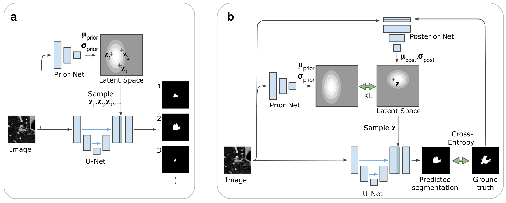
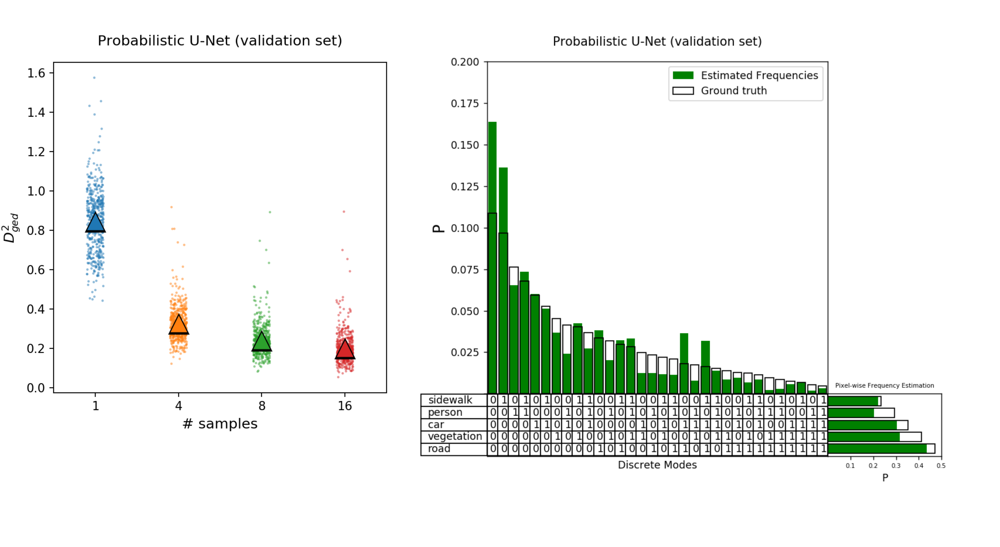

# Probabilistic U-Net

```diff
+ **Update**
+ An improved Model (the Hierarchical Probabilistic U-Net) + LIDC crops now available. See below.
```

Re-implementation of the model described in `A Probabilistic U-Net for Segmentation of Ambiguous Images' ([paper @ NeurIPS 2018](https://arxiv.org/abs/1806.05034)).

This was also a spotlight presentation at NeurIPS and a short video on the paper of similar content can be found [here](https://youtu.be/-cfFxQWfFrA) (4min).

The architecture of the Probabilistic U-Net is depicted below: subfigure a) shows sampling and b) the training setup: 


Below see samples conditioned on held-out validation set images from the (stochastic) CityScapes data set:


## Setup package in virtual environment

```
git clone https://github.com/SimonKohl/probabilistic_unet.git .
cd prob_unet/
virtualenv -p python3 venv
source venv/bin/activate
pip3 install -e .
```

## Install batch-generators for data augmentation
```
cd ..
git clone https://github.com/MIC-DKFZ/batchgenerators
cd batchgenerators
pip3 install nilearn scikit-image nibabel
pip3 install -e .
cd prob_unet
```

## Download & preprocess the Cityscapes dataset

1) Create a login account on the Cityscapes website: https://www.cityscapes-dataset.com/
2) Once you've logged in, download the train, val and test annotations and images:
    - Annotations: [gtFine_trainvaltest.zip](https://www.cityscapes-dataset.com/file-handling/?packageID=1) (241MB)
    - Images: [leftImg8bit_trainvaltest.zip](https://www.cityscapes-dataset.com/file-handling/?packageID=3) (11GB)
3) unzip the data (unzip <name>_trainvaltest.zip) and adjust `raw_data_dir` (full path to unzipped files) and `out_dir` (full path to desired output directory) in `preprocessing_config.py`
4) bilinearly rescale the data to a resolution of 256 x 512 and save as numpy arrays by running
```
cd cityscapes
python3 preprocessing.py
cd ..
```

## Training

[skip to evaluation in case you only want to use the pretrained model.]  
modify `data_dir` and `exp_dir` in `scripts/prob_unet_config.py` then:
```
cd training
python3 train_prob_unet.py --config prob_unet_config.py
```

## Evaluation

Load your own trained model or use a pretrained model. A set of pretrained weights can be downloaded from [zenodo.org](https://zenodo.org/record/1419051#.W5utoOEzYUE) (187MB). After down-loading, unpack the file via
`tar -xvzf pretrained_weights.tar.gz`, e.g. in `/model`. In either case (using your own or the pretrained model), modify the `data_dir` and
`exp_dir` in `evaluation/cityscapes_eval_config.py` to match you paths.

then first write samples (defaults to 16 segmentation samples for each of the 500 validation images):
```
cd ../evaluation
python3 eval_cityscapes.py --write_samples
```
followed by their evaluation (which is multi-threaded and thus reasonably fast):
```
python3 eval_cityscapes.py --eval_samples
```
The evaluation produces a dictionary holding the results. These can be visualized by launching an ipython notbook:
```
jupyter notebook evaluation_plots.ipynb
```
The following results are obtained from the pretrained model using above notebook:
 

## Tests

The evaluation metrics are under test-coverage. Run the tests as follows:
```
cd ../tests/evaluation
python3 -m pytest eval_tests.py
```

## Deviations from original work

The code found in this repository was not used in the original paper and slight modifications apply:

- training on a single gpu (Titan Xp) instead of distributed training, which is not supported in this implementation
- average-pooling rather than bilinear interpolation is used for down-sampling operations in the model
- the number of conv kernels is kept constant after the 3rd scale as opposed to strictly doubling it after each scale (for reduction of memory footprint)
- HeNormal weight initialization worked better than a orthogonal weight initialization


## How to cite this code
Please cite the original publication:
```
@article{kohl2018probabilistic,
  title={A Probabilistic U-Net for Segmentation of Ambiguous Images},
  author={Kohl, Simon AA and Romera-Paredes, Bernardino and Meyer, Clemens and De Fauw, Jeffrey and Ledsam, Joseph R and Maier-Hein, Klaus H and Eslami, SM and Rezende, Danilo Jimenez and Ronneberger, Olaf},
  journal={arXiv preprint arXiv:1806.05034},
  year={2018}
}
```

## License
The code is published under the [Apache License Version 2.0](LICENSE).

## Update: The Hierarchical Probabilistic U-Net + LIDC crops

We published an improved model, the Hierarchical Probabilistic U-Net at the Medical Imaging meets Neurips Workshop 2019.

The **paper** is available from arXiv under [A Hierarchical Probabilistic U-Net for Modeling Multi-Scale Ambiguities, May 2019](https://arxiv.org/abs/1905.13077).

The **model code** is freely available from DeepMind's github repo, see here: [code link](https://github.com/deepmind/deepmind-research/tree/master/hierarchical_probabilistic_unet).

The **LIDC data** can be downloaded as pngs, cropped to size 180 x 180 from Google Cloud Storage, see here: [data link](https://pantheon.corp.google.com/storage/browser/hpunet-data/lidc_crops).

A **pretrained model** can be readily applied to the data using the following Google Colab: [](https://colab.research.google.com/github/deepmind/deepmind-research/blob/master/hierarchical_probabilistic_unet/HPU_Net.ipynb).
